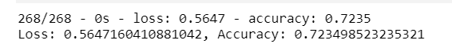
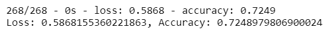
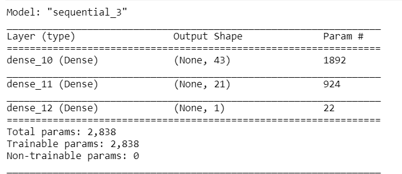
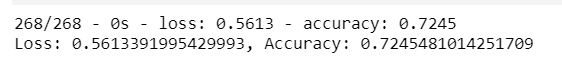
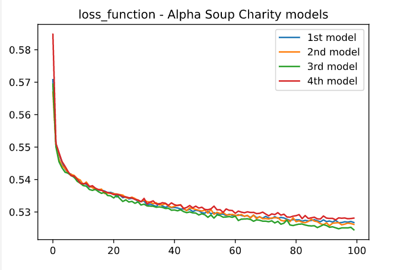

# Neural_Network_Charity_Analysis
# Overview of the analysis
Alphbet Soup, is a non-for-profit philantropic organization dedicated to protect the environment, improving people's well-being, and unify the world   
They have raised and donated $10 billion in the past 20 years. This money has been used to invest in life saving technologies and organized reforestation groups around the world. Unfortunately there have been cases in the past where a borrowing organization has disappeared with the funds. Alphabet wants to run analysis on its data to determine what organization is worth donating to and which are too high-risk. We are going to use deep learning models to determine which organizations should receive donations.

# Results
* Data Preprocessing 
** We want to determine the IS_SUCCESSFUL outcome 
** What variable(s) are considered to be the features for your model? 
** The EIN, NAME variables have no effect on the outcome and shoud be removed 
* Compiling, Training, and Evaluating the Model 
** I used:
The number of inputs set to number of variables. 
for the 1st layer I set the # of neurons to 2 * <number of varirables> (Recommendation is 2 to 4 times the number)
for 2nd layer I set the number of nodes to 1/2 of the number of variables. I chose this value based on my observation from various examples and the fact that most of the processing is completed in layer1 and in layer2 data is already reduced.
With this setting we only managed to obtain 72.4% accuracy? 

I then tried the below settings for the model 
2nd Model: 3 * # of var in the first layer 
3rd Model: + added 3rd layer with the same setting as 2nd layer  
4th Model same as first but Reducing the nerons in the first layer to # of vars 

I captured the peformance of each as shown below
 
 
 
 

As seen that the change in the model settings did not have a big change the model accuracy. 

# Summary
It seems that to get a better peformance more data is needed as changing the settings has not much effect 
For this analysis we could also use a RandomForestClassifier or Suport Vector Machine model used 
